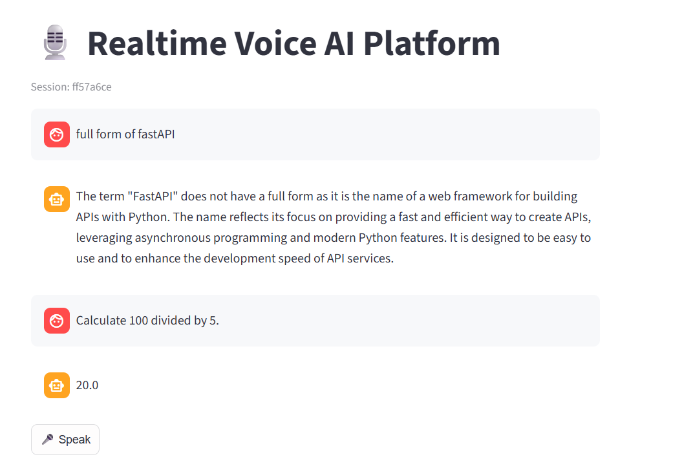
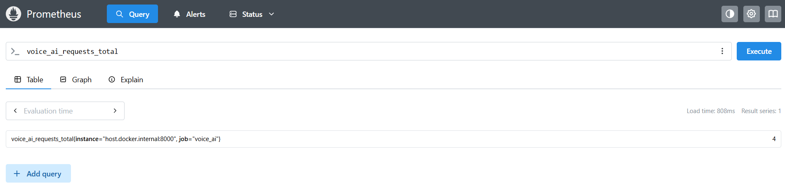
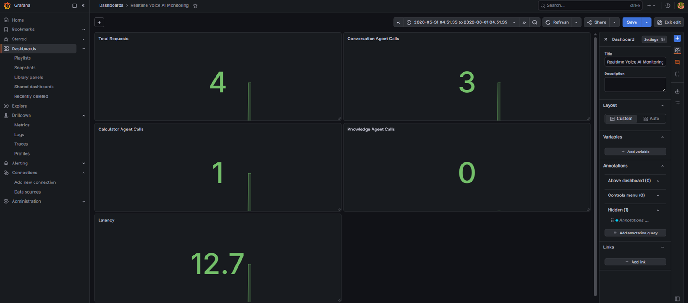
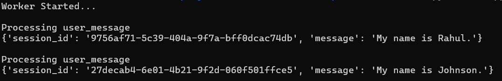

# Realtime Voice AI Customer Support Platform


Production-style realtime conversational AI platform supporting streaming speech-to-text, multi-agent orchestration, Redis-backed event processing, session-aware memory, WebSocket communication, OpenAI TTS, and observability through Prometheus and Grafana.

---

# Overview

This project implements an enterprise-style realtime Voice AI platform capable of:

* realtime voice conversations,
* speech-to-text transcription,
* text-to-speech synthesis,
* multi-agent orchestration,
* session-aware conversational memory,
* event-driven processing,
* streaming AI responses,
* monitoring and observability.

The platform combines FastAPI, Streamlit, OpenAI APIs, Redis Streams, WebSockets, Prometheus, and Grafana to simulate production-grade conversational AI systems.

---

# System Architecture

## Architecture Diagram

```text
User Voice
     │
     ▼
OpenAI Whisper STT
     │
     ▼
WebSocket Layer
     │
     ▼
Routing Agent
 ┌────┼────┐
 ▼    ▼    ▼
Conversation
Agent

Calculator
Agent

Knowledge
Agent
     │
     ▼
Redis Memory
     │
     ▼
GPT Response
     │
     ▼
OpenAI TTS
     │
     ▼
Voice Output

────────────────────────────

Background Worker
     │
     ▼
Redis Streams
     │
     ▼
Prometheus Metrics
     │
     ▼
Grafana Dashboard
```

---

# Features

## Voice AI Pipeline

* Voice recording through Streamlit
* OpenAI Whisper speech-to-text
* OpenAI text-to-speech synthesis
* End-to-end voice interaction workflow

---

## Multi-Agent Orchestration

Implemented using agent-based routing:

* Routing Agent
* Conversation Agent
* Calculator Agent
* Knowledge Agent

The Routing Agent dynamically selects the appropriate downstream agent based on user intent.

---

## Realtime Communication

* FastAPI WebSocket server
* Streaming token responses
* Low-latency conversational workflow
* Interactive voice experience

---

## Session-Aware Memory

* Unique session IDs per user
* Multi-user conversation isolation
* Context-aware responses
* Redis-backed memory storage

---

## Event-Driven Architecture

* Redis Streams event processing
* Background worker consumers
* Decoupled message handling
* Async event pipelines

---

## Monitoring and Observability

* Prometheus metrics collection
* Agent usage tracking
* Request volume monitoring
* Latency monitoring
* Grafana dashboards

---

# Technology Stack

## AI Stack

* OpenAI GPT
* OpenAI Whisper
* OpenAI Text-to-Speech

---

## Backend

* FastAPI
* Python
* WebSockets

---

## Frontend

* Streamlit
* Streamlit Mic Recorder

---

## Event Processing

* Redis
* Redis Streams
* Background Workers

---

## Monitoring

* Prometheus
* Grafana

---

## Infrastructure

* Docker
* Docker Compose

---

# Project Structure

```text
realtime-voice-ai-platform/

├── backend/
│
│   ├── app/
│   │
│   │   ├── agents/
│   │   │   ├── routing_agent.py
│   │   │   ├── conversation_agent.py
│   │   │   ├── calculator_agent.py
│   │   │   └── knowledge_agent.py
│   │   │
│   │   ├── api/
│   │   │   ├── health.py
│   │   │   ├── events.py
│   │   │   ├── voice.py
│   │   │   ├── tts.py
│   │   │   └── metrics.py
│   │   │
│   │   ├── services/
│   │   │   ├── llm_service.py
│   │   │   ├── stt_service.py
│   │   │   └── tts_service.py
│   │   │
│   │   ├── websocket/
│   │   │   └── chat_socket.py
│   │   │
│   │   ├── monitoring/
│   │   │   └── metrics.py
│   │   │
│   │   ├── events/
│   │   │   ├── redis_streams.py
│   │   │   └── event_producer.py
│   │   │
│   │   ├── workers/
│   │   │   └── event_worker.py
│   │   │
│   │   └── core/
│   │
│   └── requirements.txt
│
├── frontend/
│   ├── app.py
│   └── requirements.txt
│
├── assets/
│
├── docker-compose.yml
├── prometheus.yml
├── README.md
└── .gitignore
```

---

# Running the Application

## Clone Repository

```bash
git clone https://github.com/digit987/realtime-voice-ai-platform.git

cd realtime-voice-ai-platform
```

---

## Backend Setup

```bash
cd backend

python -m venv venv

source venv/bin/activate

pip install -r requirements.txt
```

---

## Frontend Setup

```bash
cd frontend

python -m venv venv

source venv/bin/activate

pip install -r requirements.txt
```

---

## Environment Variables

Create:

```text
backend/.env
```

```env
OPENAI_API_KEY=your_api_key

REDIS_HOST=localhost
REDIS_PORT=6379
```

---

## Start Redis

```bash
docker compose up -d
```

---

## Start Backend

```bash
cd backend

uvicorn app.main:app --reload
```

---

## Start Worker

Open a new terminal:

```bash
cd backend

python -m app.workers.event_worker
```

---

## Start Frontend

```bash
cd frontend

streamlit run app.py
```

---

# API Endpoints

## Speech-to-Text

```http
POST /api/transcribe
```

Converts voice input into text using OpenAI Whisper.

---

## Text-to-Speech

```http
POST /api/speak
```

Generates spoken audio responses using OpenAI TTS.

---

## Metrics

```http
GET /api/metrics
```

Returns Prometheus metrics.

---

## Events

```http
GET /api/events
```

Returns Redis Stream events.

---

# Monitoring

## Prometheus

Open:

```text
http://localhost:9090
```

Useful metrics:

```text
voice_ai_requests_total

conversation_agent_calls_total

calculator_agent_calls_total

knowledge_agent_calls_total

voice_ai_latency_seconds_sum
```

---

## Grafana

Open:

```text
http://localhost:3000
```

Default credentials:

```text
admin
admin
```

Example dashboard panels:

* Total Requests
* Conversation Agent Calls
* Calculator Agent Calls
* Knowledge Agent Calls
* Request Latency

---

# Screenshots

## Voice Conversation Interface



---

## Prometheus Metrics



---

## Grafana Dashboard



---

## Worker


---

# Production Engineering Highlights

This project demonstrates:

* Realtime AI systems
* Streaming conversational interfaces
* Multi-agent orchestration
* Event-driven architecture
* Redis Streams processing
* Background worker systems
* Session-aware memory
* WebSocket communication
* Speech AI pipelines
* Monitoring and observability
* Dockerized infrastructure

---

# Future Improvements

* Realtime OpenAI Realtime API integration
* True interruption handling (barge-in)
* WebRTC-based audio streaming
* Authentication and user management
* Kubernetes deployment
* Distributed worker scaling
* Advanced analytics dashboards

---

# License

MIT License
